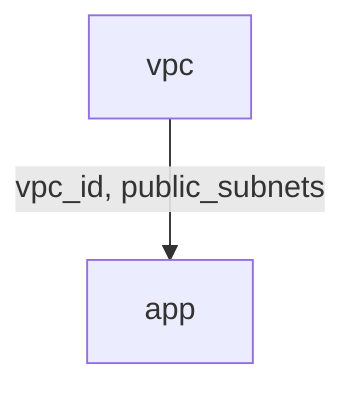

# vpc-asg-terramino

A deployment of the [Terramino tetris game](https://github.com/hashicorp/learn-terramino) using separate workspaces for the network and application components.

```mermaid
graph TD
  vpc -->|vpc_id, public_subnets| app;
```
